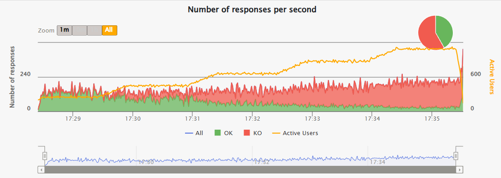

## Запуск

### 1) Поднять gRPC сервер
https://github.com/Madi-S/grpc-server-client-example

#### 1.1) Прокинуть порты в docker-compose.yml
```yaml
grpc-server:
  build:
    context: ./go
    dockerfile: Dockerfile
  restart: unless-stopped
  ports:
    - "44044:44044"
```
#### 1.1) Прокинуть порты в docker-compose.yml
```bash
docker-compose up --build
```
### 2) В текущем проекте:
#### 2.1) Соберите
```bash
sbt clean test
```
#### 2.2) Запустите тест (долгий, можно GrpcOneUser)
```bash
sbt "gatling:testOnly perf.load.load"
```
### Результаты


